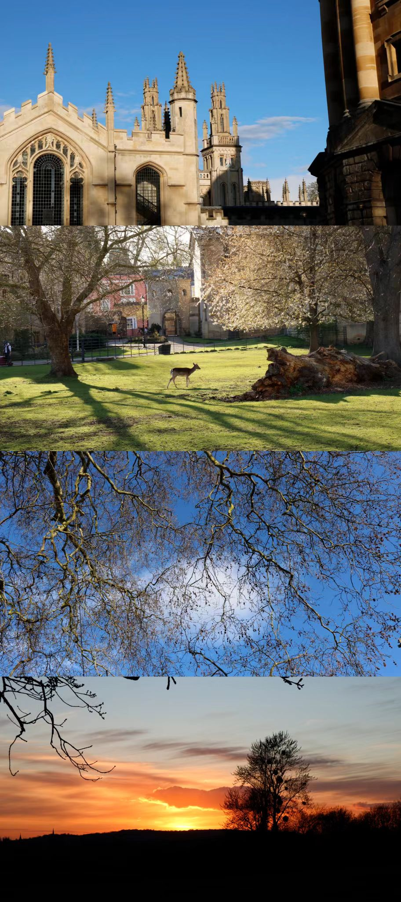
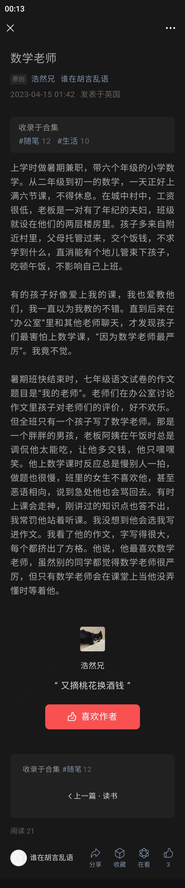

<h1> 
picStitch
</h1>

picStitch 是一款小巧易用的长图拼接 Web App

* Web APP: [picStitch](https://ps.hozen.site)
* 微信小程序: picStitch (🚧开发中)

🔐 picStitch 没有后台服务器，加载完毕后离线可用.  不必担心数据安全和隐私问题.

picStitch 是为了解决手机系统图库不支持图片拼接，以及部分手机不支持长截屏 (例如 iPhone，截止到 2023.9.2).  同时第三方拼图软件过于臃肿或者广告较多的问题.

picStitch 通过对图片的排序、拼接和裁剪图片连接处应用于以下场景：

### 多图拼接

发朋友圈是一个典型场景

### 长截屏拼接

通过裁剪图片的边界使截屏完美拼接

### 影视台词拼接

💡为了最大限度的保证图片质量，拼接过程中不会对图片进行任何压缩. 保存时也尽可能保持最大的尺寸，因此在处理超大图片时可能会略有卡顿.
